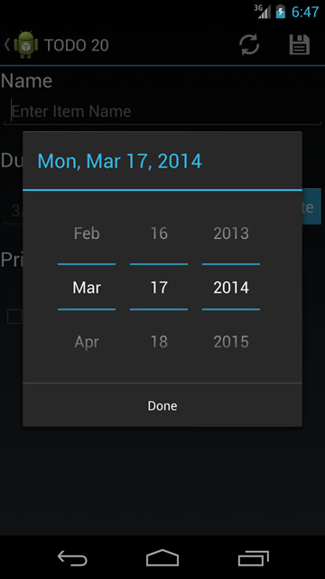
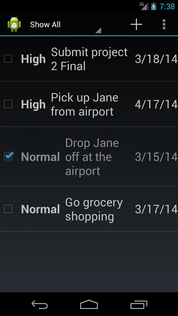

# TODO20 User Documentation

1. [Installation](#installation)
1. [Launching TODO20](#launchingTODO20)
1. [First Time Welcome Screen](#wlecomeScreenNoUsers)
1. [Creating Users](#creatingUsers)
1. [Signing In](#signingIn)
1. [Managing Tasks](#managingTasks)
	1. [Adding Tasks](#addingTasks)
	1. [Editing Tasks](#editingTasks)
	1. [Completing Tasks](#completingTasks)
	1. [Deleting Tasks](#deletingTasks)
1. [Managing Settings](#managingSettings)
	1. [Deleting Users](#deletingUsers)
1. [Thank You and Reporting Issues](#thankYou)

----------
## [Installation](id:installation)

TODO20 can be installed by downloading the APK to the device and launching it from a file browser (ex. Solid Explorer).

Ther APK can be downloaded from here: [Latest TODO20 Release](https://github.com/gt-ud-softeng/RepTeam2.20/releases "Latest TODO20 Release")

## [Launching TODO20](id:launchingTODO20)

Once installed, TODO20 can be found in the apps menu under as **TODO20**. Touching the application icon will launch TODO20.

## [First Time Welcome Screen](id:welcomeScreenNoUsers)

When TODO20 is launched for the first time, the **welcome screen** is displayed. The welcome screen allows only one option: **Create User**. Touching Create User will take you to the Create User screen, which we will cover next.

### Welcome Screen with No Users

## [Creating Users](#creatingUsers)

The **Create User** screen allows you to create a user within TODO20. Each user gets their own task list and settings.

The **username** field represents the name that the user should be identified as. This field require at least for characters and is limited to alpha-numeric characters only.

	Note: The same username cannot be used twice on the same device.

The **default due date (days)** field represents how many days ahead new tasks should be due by default. When a new task is created the due date is automatically set by this value, but it can be modified. Use this to speed up your task entry once you determine your ideal task process flow. Valid values are whole numbers between 0 and 365, giving you an option of up to 1 year.

The **default task priority** field represents the default priority for new tasks. As with the default due date, new tasks are automatically assigned this priority, but can be modified. Again, use this to speed up your task entry once you determine your ideal task process flow.

Once you have entered information into these fields, touch the **Create User** button to create the user. This button will validate the fields according to the requirements above before creating the user. If any validation fails, you will be prompted with an informative message.

If you change your mind, you can always exit the Create User screen by touching **Create New User** in the top-left corner.

### [Creating Users](id:creatingUsers)

## [Signing In](id:signingIn)

Once a user exists, the application will go to the **Sign In** screen by default. The Sign In screen has a drop down of users to select from. If the user you are looking for is not found, you can touch **Create User** to create a new one. If you do find the user you are looking for, select their username from the drop down and touch **Login**.

### [User Sign In Screen](id:welcomeScreen)

## [Managing Tasks](id:managinTasks)

Once signed in, you will be taken to the [User Task List](#userTaskList). The Task List shows the tasks you've created. Tasks are ordered by priority, then by due date, then by name.

The Task List can be filtered to show all tasks or only incomplete tasks using the [View Mode Options](#viewModeOptions) toggle in the top-left corner.

New tasks can be created using the **Add Task** button, indicated by the **+** sign. This button will take you to the [Add Task Screen](#addTaskItem).

Touching the three vertical dots on the top-right of the screen will open the [Task Sub-Menu](#taskSubMenu). The Task Menu contains the options **Settings** and **Sign Out**.

The Settings button will take you to the [User Settings Screen](#userSettingsScreen), where you can adjust the settings originally configured in the **Create User** screen.

The Sign Out button will take you back to the [Welcome Screen](#welcomeScreen), where you can select a different user or create a new user.

Below the Task Menu will be the list of tasks. This list may appear empty if no tasks exist. If a task does exist, you will see a check box indicating whether the task is complete, the priority of the task, the task name, and the due date all arranged from left to right. Touching the check box will toggle the task between complete and incomplete. Touching anywhere else on the task will open the [Edit Task Item](#editTaskItem).

### [User Task List](id:userTaskList)

### [View Mode Options](id:viewModeOptions)

### [Add Task Item](id:addTaskItem)

### [Task Sub-Menu](id:taskSubMenu)

### [User Settings Screen](id:userSettingsScreen)

---
After clicking the **Add Task** button, you will see the **Add Task screen**. The Add Task screen allows you to create a new task and save it in your to-do list.

## [Adding Tasks](id:addingTasks)

The **Name** field represents the name of the task. This should be short description of the task. This field is required.

	Note: The name of the task can be as long as you wish, but short names are recommended to make the most of space on the Task List. Longer names take up multiple lines and can cause the items to show larger on the Task List.

The **Due Date** field represents the due date of the task. It can be set by clicking the **Choose Date** button, which will display a popup in which you can select a date. This field defaults to the number of default due days set by the user in [User Settings Screen](#userSettingsScreen) or [Create User Screen](#createUserScreen) after the current date. 

### Item Date Selection

The **Priority** field represents the priority of the task. High priority tasks are shown first in the Task List. This field defaults to the default priority set in [User Settings Screen](#userSettingsScreen) or [Create User Screen](#createUserScreen).

The **Completed** field represents whether the task is completed. Completed tasks can be filtered out of the Task List to help you focus on tasks that need to be done.

The menu bar contains two options on the Add Task screen: **Revert** and **Save**.

The Revert button performs and undo on any changes made to the task. In the case of a new task, this button returns all fields to their default values.

The Save button will validate the fields according to the requirements specified above and save the task, taking you back to the [User Task List](id:userTaskList).

## [Editing Tasks](id:editingTasks)

When you select an existing task you will be taken to the [Edit Task Item Screen](#editTaskItem), its information is loaded into a screen very similar to the [Add Task Item](#addingTasks). Fields are the same and have the same requirements. The menu options also exist, with the addition of the **Delete** button which looks like a trash can.

Touching the Delete button will prompt you for a confirmation. If you confirm that you do want to delete the task, it will be removed from the Task List.

	Note: This action is not reversible. Deleting a task will lose all of its information permanently. Please be cautious.

### [Edit Task item](id:editTaskItem)

## [Completing Tasks](id:completing Tasks)

As stated above, tasks can be marked complete/incomplete from the Task List itself by touching the check box on the task. This provides a quick way of marking items off of your Task List. When a task is marked complete, it also shows up gray on the Task List. Completing tasks can be reversed using the toggle button, or by opening the task for edit.

### Completed Task Item

## [Deleting Tasks](id:deletingTasks)

Deleting tasks is managed from the [Edit Task Item Screen](#editTaskItem). Please refer there for information. 

## [Managing Settings](id:managingSettings)

Touching the **Settings** button on the Task List will open the [User Settings Screen](#userSettingsScreen). The User Settings screen is similar to the [Create User Screen](#createUserScreen). It has the same fields with the same requirements. From here you can change your default task information, or even your username.

## Deleting Users

The Settings screen has a **Delete This User** button to remove the current user. Clicking this button will prompt you to confirm the action. Deleting a user deletes all of their tasks from the app and returns you to the **Login screen**.

	Note: This action is not reversible. Be absolutely sure this is the action you would like to take before confirming the delete.

### Delete User Confirmation

## [Thank You and Reporting Issues](id:thankYou)

Thank you for using TODO20. We hope that this application helps you to be more productive in managing your tasks. Should you experience any issues, please contact us on our Github page so that we can resolve the issue as quickly as possible. [The TODO20 GitHub Issues Page](https://github.com/gt-ud-softeng/RepTeam2.20/issues?state=open)

-- The TODO20 Team
